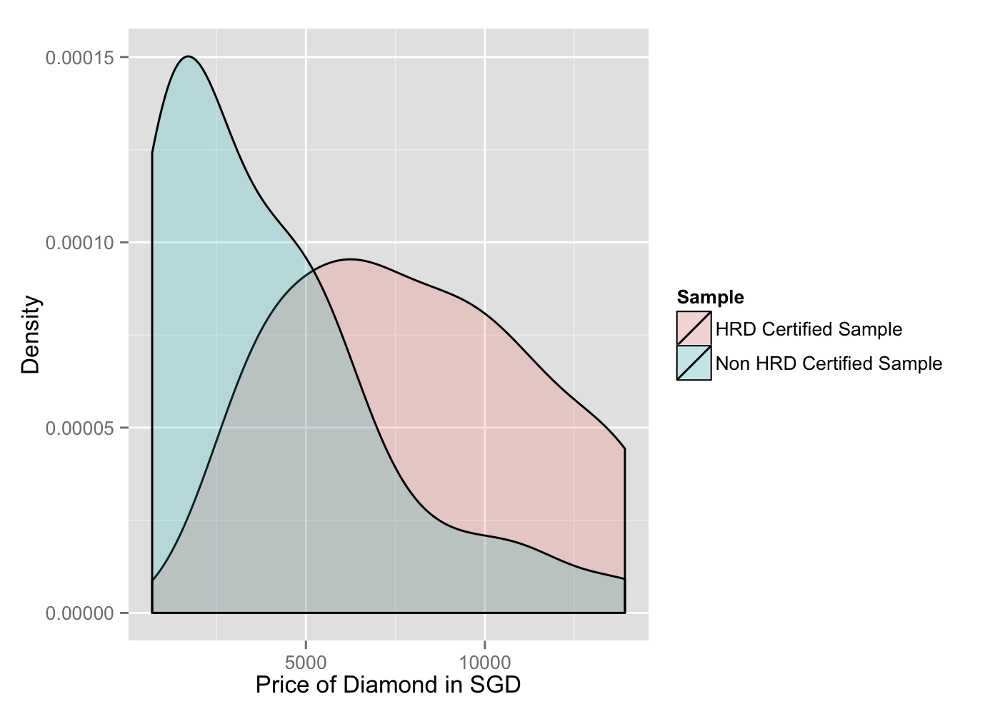
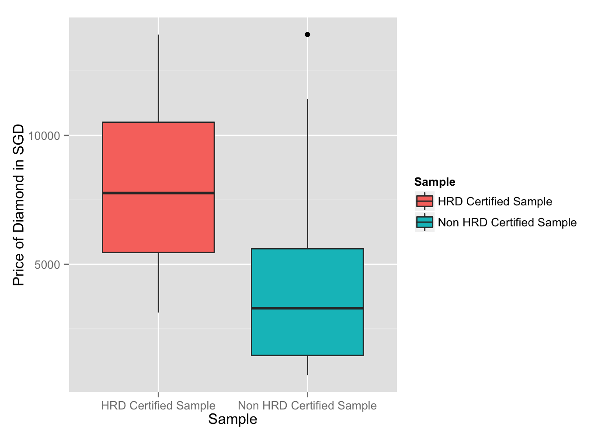

# On Average, are Diamonds Certified by HRD Priced Higher than those Certified by Other Organizations?
Prasanna  
August 30, 2015  


# The Hypotheses
Let us state our Hypotheses:

* <B>Null Hypothesis (H~0~)</B> : On average, there is no difference in diamond's pricing, between HRD or any other organization
* <B>Alternate Hypothesis (H~A~)</B>: On average, HRD certified diamonds are priced higher (one-sided test)

Mathematically, the hypothese are expressed below:

* H~0~: μ~diff~ = 0
* H~A~: μ~diff~ > 0

# The Data


We separate the data sets - diamonds certified by HRD and other diamonds. There are ``79`` observations of HRD Diamonds and ``229`` non-HRD Certified Diamonds.

# Central Limit Theorm: Checking the Conditions for Hypothesis Testing for Paired Data
The conditions for hypothesis testing:

* <B>Independence:</B> Sampled observations must be independent. Random sample must be collected with replacement because the size of HRD Certified diamond is small
* <B>Sample Size / Skew: </B> The no of elements must be more than 30.

We select a size of <code>40</code> with replacement.




# The Test Statistic


```r
zScore <- xBar / standardError(Diff)
zScore
```

```
## [1] 5.758039
```

```r
# Calculating p-value
# 1-pnorm() because we are doing a one-sided test - greater than
pValue <- 1-pnorm( zScore ) 
pValue
```

```
## [1] 0.000000004254841
```

# Null Hypothesis (H~0~) is Rejected
The **Null Hypothesis (H~0~)** is rejected because the <code>pValue</code> is lesser than the significance value of <code>0.05</code>.

